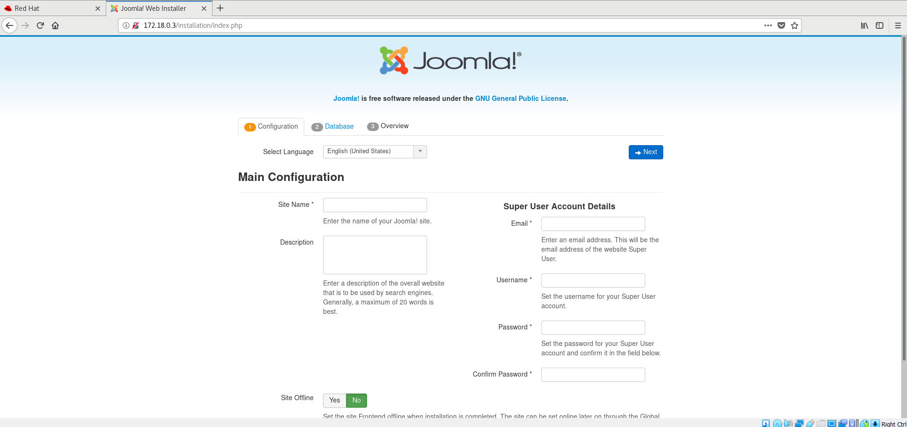
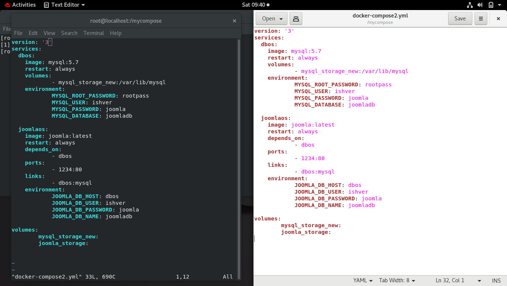
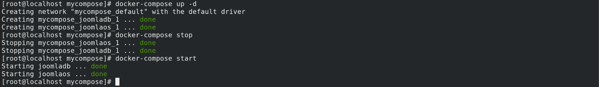
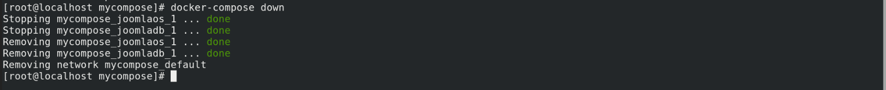

# Joomla MYSQL-Database Complete Setup Docker_Project_IIEC_RISE

Joomla is an open source Content Management System (CMS), which is used to build websites and online applications. It is free and extendable which is separated into front-end templates and back-end templates (administrator). Joomla is developed using PHP, Object Oriented Programming, software design patterns and MySQL (used for storing the data). This Docker_Compose file will provide you a complete environment in which you can create websites with backend support by a single command in less than one second.

Using this repository you can do these things automatically:-

    Download images from DockerHub Community.
    Create Docker volumes for permanent storage of your data.
    Set Up MySQl Database for data storage.
    Set up Joomla framework for creating websites.

# Pre-requisites:

- Redhat Enterprise Linux Version 8
- Docker
- Joomla
- MYSQL

# Setup & Installations

First of all install Redhat_Enterprise_Linux_Version_8 and configure yum properly make sure you have installed the latest, stable and compatible versions of Docker, Joomla, MYSQL server, Docker Compose.

# If you dont have, follow these steps:

- Install Docker on Redhat8:

Configure yum by adding docker.repo:

    $ cd /etc/yum.repos.d
    $ gedit docker.repo
        here add these lines:

        [docker_repo]
        name=docker_repo
        baseurl=https://download.docker.com/linux/centos/docker-ce.repo
        gpgcheck=0

        save it.
    $ yum install docker-ce --nobest

# Start Docker:

    $ sudo systemctl start docker

# Now install Docker Compose:-

    $ sudo curl -L https://github.com/docker/compose/releases/download/1.21.2/docker-compose-`uname -s`-`uname -m` -o /usr/local/bin/docker-compose

    $ sudo chmod +x /usr/local/bin/docker-compose

### For downloading the Images go to https://hub.docker.com

Download the Joomla image:

    $ docker pull joomla:latest

Download the MySQL image:

    $ docker pull mysql:5.7

# For Setup:

## MySql Server:

    $ docker run -dit -e MYSQL_ROOT_PASSWORD=(your password)  -e MYSQL_USER=(your username) -e MYSQL_PASSWORD=(mysql password)  -e MYSQL_DATABASE=(your database password) -v mysql_storage:/var/lib/mysql --name dbos mysql:5.7

## MySql Client:

    $ mysql -h serverIP -u username -p (your_password)

## Joomla Server:

    $ docker run -dit -e JOOMLA_DB_HOST=(Database Hostname)  -e JOOMLA_DB_USER=(your Username)  -e JOOMLA_DB_PASSWORD=(your password) -e JOOMLA_DB_NAME=(Database name)  -v joomla_storage:/var/lib/mysql  -p 1234:80 --link dbos --name joomos joomla:latest

# Docker-Compose

Install a docker-compose software from https://docs.docker.com/compose/install. Make a compose file using:-

    $ mkdir mycompose

You can create/edit your docker-compose file using

    $ vim docker-compose.yml

Here in this **docker-compose.yml** file edit the **joomla_server** and **MySQL server** command in yaml format likes this:-

# Now we are moving to launch our **Docker-Compose**

Open your terminal and go to that directory where you have saved your compose file:-

    $ cd (your compose directory)
    $ docker-compose up

or

    $ docker-compose -f (compose_filename) up

Uptill now our all setup goes fine.

## Now launch firefox browser and in search bar type http://URL:port as in http://192.168.xx.xx:1234 and hit **Enter**. If everything working good and properly.

# Docker-compose start stop:

- _To stop docker-compose, use command_ `docker-compose stop`. _To start docker-compose use command_ `docker compose start`.

# Docker-compose down:

- _You can easily stop the containers using command_ `docker compose down`

# Credits:

Special thanks to our sir Mr. Vimal Daga I have learned a lot under Sir guidence

# Developers:

Stay tuned for more interesting projects. Do Follow & Visit: www.github.com/DipadityaDas
